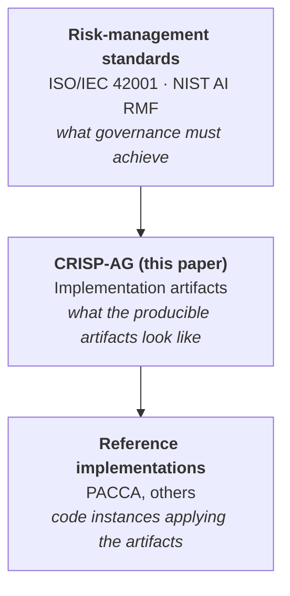

# CRISP-AG — An Artifact-Centered Framework for Enterprise Agentic AI Governance

**Practitioner white paper. Version 2.3, May 2026.**

[](#status)
[](LICENSE)
[](https://docs.google.com/document/d/1EHvDCwNNVGyLs0m4kevjWabkfby0A8HogpBAbzNp5fI/preview)

> 📄 **[Read the full paper →](https://docs.google.com/document/d/1EHvDCwNNVGyLs0m4kevjWabkfby0A8HogpBAbzNp5fI/preview)** *(Google Doc, ~30 min read)*

---

## What CRISP-AG is

Enterprise adoption of agentic AI — multi-step, tool-calling, and sometimes multi-agent architectures built on large language models — is outpacing the operational governance artifacts needed to deploy them safely. **CRISP-AG** is an *artifact-centered* implementation framework for governed agentic AI deployment.

CRISP-AG extends the lifecycle logic of [CRISP-DM](https://en.wikipedia.org/wiki/Cross-industry_standard_process_for_data_mining) by adding three agentic-specific phases: **Operational Context Assembly**, **Trust/Governance/Risk Architecture**, and **Iterative Refinement and Scale**. It also formalizes four implementation artifacts that are under-specified in common AI governance and MLOps practices.

## Where CRISP-AG sits


The standards establish what governance must achieve. CRISP-AG specifies what the producible artifacts look like. Reference implementations make them concrete.
## The four core artifacts
| Artifact | What it specifies | Why it's under-specified today |
|---|---|---|
| **Delegation Authority Scoping** | Which classes of decision a given agent can autonomously commit, who must approve which reversibility levels, and how the boundary changes by domain | Standards say "humans in the loop"; CRISP-AG specifies *which* humans, *for what*, *with what reversibility threshold* |
| **Contractor Access Governance** | The boundary controls for external dependencies (LLM providers, retrieval indexes, third-party tools) including prompt-injection blast-radius limits | Most enterprises treat the LLM provider as a single vendor relationship; CRISP-AG decomposes it |
| **Orchestration Contract** | When and how agents may call which tools, with what audit trail, under what failure-mode policies | "Tool use" is a feature in agent SDKs; CRISP-AG is the policy layer above it |
| **Capability Frontier Classification** | Which classes of agent face which review tiers, with explicit threshold framing for what constitutes capability frontier vs. capability creep | Standards say "high-risk applications"; CRISP-AG operationalizes the threshold |
## The nine-phase lifecycle
CRISP-AG extends CRISP-DM's six phases with three agentic-specific phases. Phase gates are explicit and per-class compressed tracks reduce overhead for lower-risk agent classes (Class 1 / Class 4) without losing rigor for higher-risk classes (Class 2 / Class 3).
| Phase | Origin | Purpose |
|---|---|---|
| 1. Business / Mission Understanding | CRISP-DM | What problem, whose pain |
| 2. Operational Context Assembly | **CRISP-AG** | Tools, data, dependency surface, regulatory regime |
| 3. Data Understanding | CRISP-DM | Quality, lineage, sufficiency |
| 4. Data Preparation | CRISP-DM | Curation for the agent's RAG and memory layers |
| 5. Modeling / Agent Design | CRISP-DM (extended) | Choice of model family, tool surface, prompt strategy |
| 6. Trust / Governance / Risk Architecture | **CRISP-AG** | Where the four core artifacts land |
| 7. Evaluation | CRISP-DM (extended) | Capability + safety + cost benchmarks |
| 8. Deployment | CRISP-DM | Integration with the surrounding system |
| 9. Iterative Refinement and Scale | **CRISP-AG** | Behavioral-change discipline post-launch |
Full phase-gate definitions and per-class tracks are in [§6 of the paper](https://docs.google.com/document/d/1EHvDCwNNVGyLs0m4kevjWabkfby0A8HogpBAbzNp5fI/preview).
## Reference implementation
[**PACCA**](https://github.com/drdgreed/pacca) — a multi-agent platform for healthcare prior authorization — is one Class 2/3 reference implementation. PACCA's seven-branch escalation tree and Medical Director gate instantiate **Delegation Authority Scoping**; its harness-engineering discipline implements the **Orchestration Contract**; its dual-collection RAG (authoritative guidelines vs. case precedents with explicit trust levels) is one realization of the **Contractor Access Governance** boundary.
## Status
CRISP-AG v2.3 is positioned as a **practitioner framework and validation agenda**, not a completed empirical theory. Claims are framed as design propositions and implementation guidance.
The evidence base for v2.3 is practitioner experience, structured framework comparison, and alignment with standards and security references — not a controlled empirical validation. The paper includes an explicit **Threats to Validity** subsection (§3.2), a **Threats Not Currently Covered** subsection (§7.2), and a **Validation Agenda** (§11) that names what would have to be true for the framework's claims to be falsified.
## How to cite

```bibtex
@techreport{reed2026crispag,
  author      = {Reed, David G.},
  title       = {{CRISP-AG}: An Artifact-Centered Framework for Enterprise Agentic AI Governance},
  type        = {Practitioner White Paper},
  number      = {v2.3},
  institution = {drdavidreed.com},
  year        = {2026},
  month       = {may},
  url         = {https://drdavidreed.com/portfolio}
}
```

## Feedback

CRISP-AG benefits from peer review and adversarial critique. If you've applied a CRISP-AG-style framework in your organization, I'd value your feedback.

For other governance or agentic-AI work, see [drdavidreed.com/portfolio](https://drdavidreed.com/portfolio).

## License

This repository is licensed under [Creative Commons Attribution 4.0](https://creativecommons.org/licenses/by/4.0/). You may share, adapt, and build on this work with attribution.

 repository is licensed under Creative Commons Attribution 4.0. You may share, adapt, and build on the framework with attribution.
